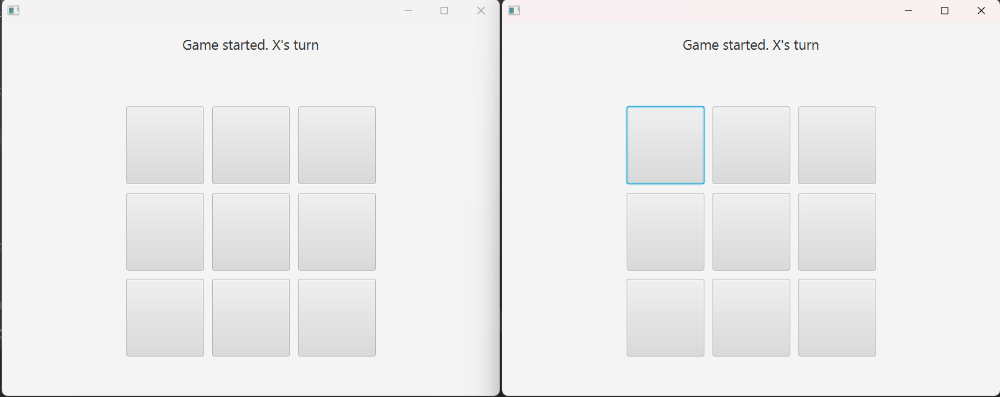
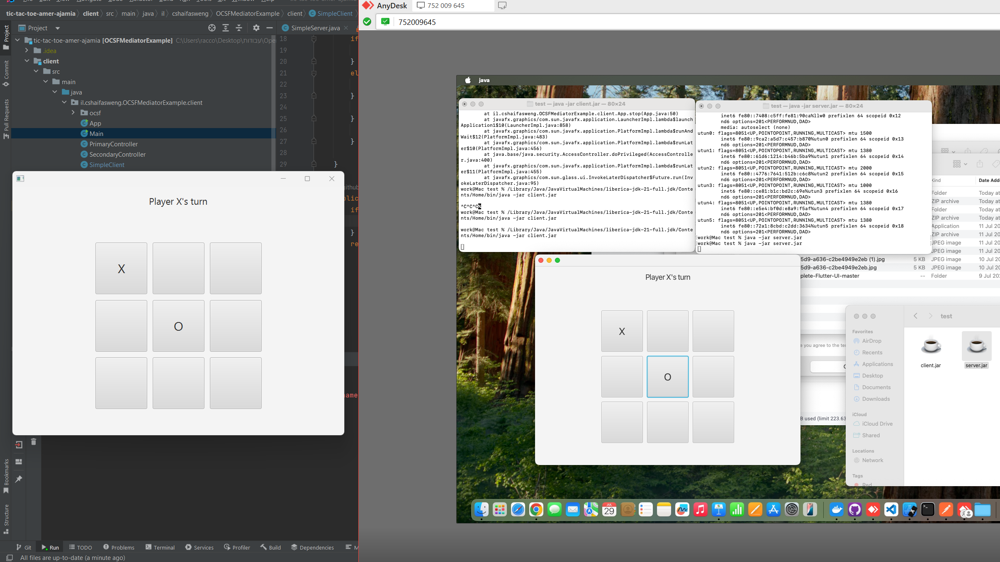
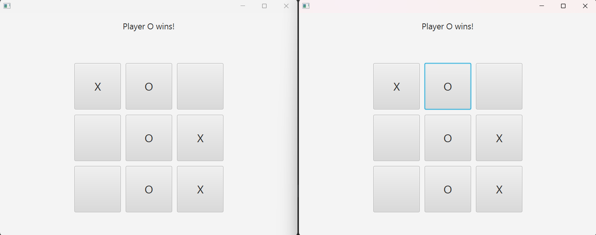

# Multiplayer Tic Tac Toe – Lab 5 Report
**Student:** Amer Ajamia  
**ID:** 2089655407

---

## 📌 Project Description

This project implements a **multiplayer Tic Tac Toe** game using a **Client–Server architecture** built on top of the **OCSF framework** and **EventBus** for communication. The server coordinates the game between two clients. Each client features a JavaFX-based GUI, allowing users to play interactively.

---

## 📷 Demonstration Screenshots

### 🎮 Game Start (Player X and O Connected)


---

### ✏️ Game in Progress


---

### 🏆 Player Wins


---

## 🧪 How to Run

1. **Start Server**
   ```bash
   java -jar server.jar
2. **Start Client**
   ```bash
   java -jar client.jar

Ensure both clients use the same IP and port (default: localhost:3000). If running on different machines, refer to the provided "network setup guide".